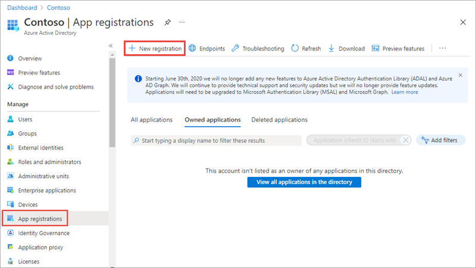
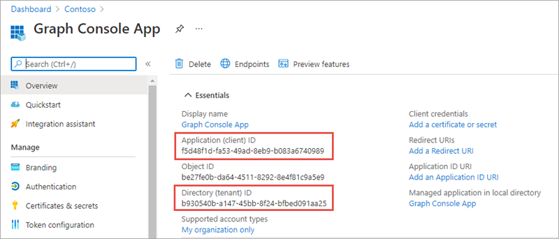
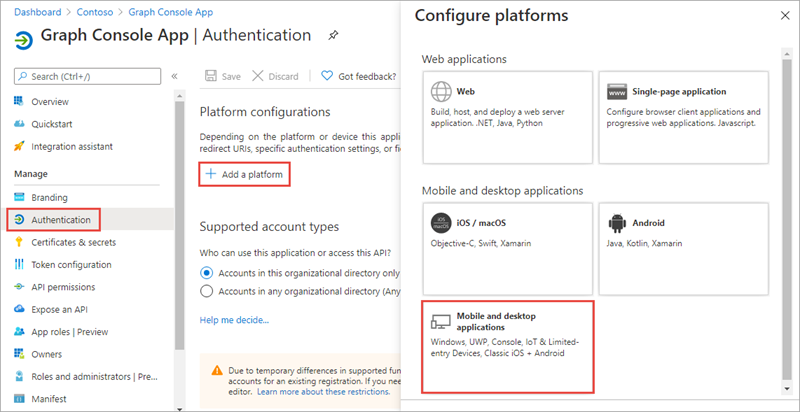
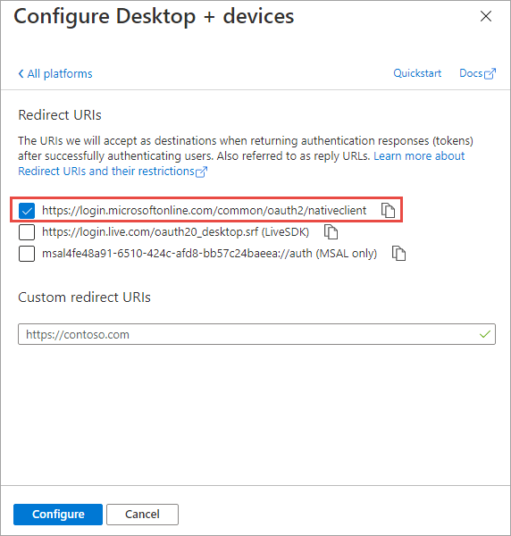
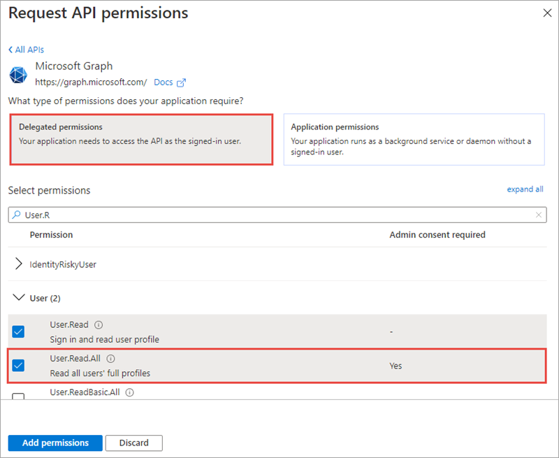

# Exercise 1: Working with users in the organization

In this exercise, you'll create an Azure AD application registration using the Azure Active Directory admin center, a .NET Core console application, and query Microsoft Graph for user data.

## Prerequisites

Developing Microsoft Graph apps requires a Microsoft 365 tenant.

For the Microsoft 365 tenant, follow the instructions on the [Microsoft 365 Developer Program](https://developer.microsoft.com/microsoft-365/dev-program) site for obtaining a developer tenant if you don't currently have a Microsoft 365 account.

You'll use the .NET SDK to create custom Microsoft Graph app in this module. The exercises in this module assume you have the following tools installed on your developer workstation.

> [!IMPORTANT]
> In most cases, installing the latest version of the following tools is the best option. The versions listed here were used when this module was published and last tested.

- [.NET SDK](https://dotnet.microsoft.com/) - v5.\* (or higher)
- [Visual Studio Code](https://code.visualstudio.com)

You must have the minimum versions of these prerequisites installed on your workstation.

## Task 1: Create an Azure AD application

Open a browser and navigate to the [Azure Active Directory admin center (https://aad.portal.azure.com)](https://aad.portal.azure.com). Sign in using a **Work or School Account** that has global administrator rights to the tenancy.

Select **Azure Active Directory** in the left-hand navigation.

Select **Manage > App registrations** in the left-hand navigation.

  

On the **App registrations** page, select **New registration**.

  

On the **Register an application** page, set the values as follows:

- **Name**: Graph Console App
- **Supported account types**: Accounts in this organizational directory only (Contoso only - Single tenant)

    

    Select **Register**.

On the **Graph Console App** page, copy the value of the **Application (client) ID** and **Directory (tenant) ID**; you'll need these in the application.

  

Select **Manage > Authentication**.

In the **Platform configurations** section, select the **Add a platform** button. Then in the **Configure platforms** panel, select the **Mobile and desktop applications** button:



In the **Redirect URIs** section of the **Configure Desktop + devices** panel, select the entry that ends with **nativeclient**, and then select the **Configure** button:



In the **Authentication** panel, scroll down to the **Allow public client flows** section and set the toggle to **Yes**.


Select **Save** in the top menu to save your changes.

### Grant Azure AD application permissions to Microsoft Graph

After creating the application, you need to grant it the necessary permissions to Microsoft Graph.

Select **API Permissions** in the left-hand navigation panel.


Select the **Add a permission** button.

In the **Request API permissions** panel that appears, select **Microsoft Graph** from the **Microsoft APIs** tab.


When prompted for the type of permission, select **Delegated permissions**.

Enter **User.R** in the **Select permissions** search box and select the **User.Read.All** permission, followed by the **Add permission** button at the bottom of the panel.



In the **Configured Permissions** panel, select the button **Grant admin consent for [tenant]**, and then select the **Yes** button in the consent dialog to grant all users in your organization this permission.

> [!NOTE]
> The option to **Grant admin consent** here in the Azure AD admin center is pre-consenting the permissions to the users in the tenant to simplify the exercise. This approach allows the console application to use the [resource owner password credential grant](/azure/active-directory/develop/v2-oauth-ropc), so the user isn't prompted to grant consent to the application that simplifies the process of obtaining an OAuth access token. You could elect to implement alternative options such as the [device code flow](/azure/active-directory/develop/v2-oauth2-device-code) to utilize dynamic consent as another option.

## Task 2: Create .NET Core console application

Open your command prompt, navigate to a directory where you have rights to create your project, and run the following command to create a new .NET Core console application:

```console
dotnet new console -o graphconsoleapp
```

After creating the application, run the following commands to add the Microsoft Authentication Library (MSAL), Microsoft Graph .NET SDK, and a few configuration packages to the project:

```console
cd graphconsoleapp
dotnet add package Microsoft.Identity.Client
dotnet add package Microsoft.Graph
dotnet add package Microsoft.Extensions.Configuration
dotnet add package Microsoft.Extensions.Configuration.FileExtensions
dotnet add package Microsoft.Extensions.Configuration.Json
```

Open the application in Visual Studio Code using the following command:

```console
code .
```

If Visual Studio code displays a dialog box asking if you want to add required assets to the project, select **Yes**.

### Update the console app to enable nullable reference types

Nullable reference types refers to a group of features introduced in C# 8.0 that you can use to minimize the likelihood that your code causes the runtime to throw System.NullReferenceException.

Nullable reference types are enabled by default in .NET 6 projects, they are disabled by default in .NET 5 projects.

Ensuring that nullable reference types are enabled is not related to the use of Microsoft Graph, it just ensures the exercises in this module can contain a single set of code that will compile without warnings when using either .NET 5 or .NET 6.

Open the **graphconsoleapp.csproj** file and ensure the `<PropertyGroup>` element contains the following child element:

```xml
<Nullable>enable</Nullable>
```

### Update the console app to support Azure AD authentication

Create a new file named **appsettings.json** in the root of the project and add the following code to it:

```json
{
  "tenantId": "YOUR_TENANT_ID_HERE",
  "applicationId": "YOUR_APP_ID_HERE"
}
```

Update properties with the following values:

- `YOUR_TENANT_ID_HERE`: Azure AD directory ID
- `YOUR_APP_ID_HERE`: Azure AD client ID

#### Create helper class

Create a new folder **Helpers** in the project.

Create a new file **MsalAuthenticationProvider.cs** in the **Helpers** folder and add the following code:

```csharp
using System.Net.Http;
using System.Net.Http.Headers;
using System.Security;
using System.Threading.Tasks;
using Microsoft.Identity.Client;
using Microsoft.Graph;

namespace Helpers
{
  public class MsalAuthenticationProvider : IAuthenticationProvider
  {
    private static MsalAuthenticationProvider? _singleton;
    private IPublicClientApplication _clientApplication;
    private string[] _scopes;
    private string _username;
    private SecureString _password;
    private string? _userId;

    private MsalAuthenticationProvider(IPublicClientApplication clientApplication, string[] scopes, string username, SecureString password)
    {
      _clientApplication = clientApplication;
      _scopes = scopes;
      _username = username;
      _password = password;
      _userId = null;
    }

    public static MsalAuthenticationProvider GetInstance(IPublicClientApplication clientApplication, string[] scopes, string username, SecureString password)
    {
      if (_singleton == null)
      {
        _singleton = new MsalAuthenticationProvider(clientApplication, scopes, username, password);
      }

      return _singleton;
    }

    public async Task AuthenticateRequestAsync(HttpRequestMessage request)
    {
      var accessToken = await GetTokenAsync();

      request.Headers.Authorization = new AuthenticationHeaderValue("bearer", accessToken);
    }

    public async Task<string> GetTokenAsync()
    {
      if (!string.IsNullOrEmpty(_userId))
      {
        try
        {
          var account = await _clientApplication.GetAccountAsync(_userId);

          if (account != null)
          {
            var silentResult = await _clientApplication.AcquireTokenSilent(_scopes, account).ExecuteAsync();
            return silentResult.AccessToken;
          }
        }
        catch (MsalUiRequiredException){ }
      }

      var result = await _clientApplication.AcquireTokenByUsernamePassword(_scopes, _username, _password).ExecuteAsync();
      _userId = result.Account.HomeAccountId.Identifier;
      return result.AccessToken;
    }
  }
}
```

### Incorporate Microsoft Graph into the console app

Open the **Program.cs** file and replace the entire contents with the following code:

```csharp
using System;
using System.Collections.Generic;
using System.Security;
using Microsoft.Identity.Client;
using Microsoft.Graph;
using Microsoft.Extensions.Configuration;
using Helpers;

namespace graphconsoleapp
{
    public class Program
    {
        public static void Main(string[] args)
        {
            Console.WriteLine("Hello World!");
        }
    }
}
```

Add the following method `LoadAppSettings` to the `Program` class. The method retrieves the configuration details from the **appsettings.json** file previously created:

```csharp
private static IConfigurationRoot? LoadAppSettings()
{
  try
  {
    var config = new ConfigurationBuilder()
                      .SetBasePath(System.IO.Directory.GetCurrentDirectory())
                      .AddJsonFile("appsettings.json", false, true)
                      .Build();

    if (string.IsNullOrEmpty(config["applicationId"]) ||
        string.IsNullOrEmpty(config["tenantId"]))
    {
      return null;
    }

    return config;
  }
  catch (System.IO.FileNotFoundException)
  {
    return null;
  }
}
```

Add the following method `CreateAuthorizationProvider` to the `Program` class. The method will create an instance of the clients used to call Microsoft Graph.

```csharp
private static IAuthenticationProvider CreateAuthorizationProvider(IConfigurationRoot config, string userName, SecureString userPassword)
{
  var clientId = config["applicationId"];
  var authority = $"https://login.microsoftonline.com/{config["tenantId"]}/v2.0";

  List<string> scopes = new List<string>();
  scopes.Add("User.Read");
  scopes.Add("User.Read.All");

  var cca = PublicClientApplicationBuilder.Create(clientId)
                                          .WithAuthority(authority)
                                          .Build();
  return MsalAuthenticationProvider.GetInstance(cca, scopes.ToArray(), userName, userPassword);
}
```

> [!IMPORTANT]
> Notice in the previous code that two scopes will be included in the request. These are the permissions you added to the Azure AD app.

Add the following method `GetAuthenticatedGraphClient` to the `Program` class. The method creates an instance of the `GraphServiceClient` object.

```csharp
private static GraphServiceClient GetAuthenticatedGraphClient(IConfigurationRoot config, string userName, SecureString userPassword)
{
  var authenticationProvider = CreateAuthorizationProvider(config, userName, userPassword);
  var graphClient = new GraphServiceClient(authenticationProvider);
  return graphClient;
}
```

Add the following method `ReadPassword` to the `Program` class. The method prompts the user for their password:

```csharp
private static SecureString ReadPassword()
{
  Console.WriteLine("Enter your password");
  SecureString password = new SecureString();
  while (true)
  {
    ConsoleKeyInfo c = Console.ReadKey(true);
    if (c.Key == ConsoleKey.Enter)
    {
      break;
    }
    password.AppendChar(c.KeyChar);
    Console.Write("*");
  }
  Console.WriteLine();
  return password;
}
```

Add the following method `ReadUsername` to the `Program` class. The method prompts the user for their username:

```csharp
private static string ReadUsername()
{
  string? username;
  Console.WriteLine("Enter your username");
  username = Console.ReadLine();
  return username ?? "";
}
```

Locate the `Main` method in the `Program` class. Add the following code to the end of the `Main` method to load the configuration settings from the **appsettings.json** file:

```csharp
var config = LoadAppSettings();
if (config == null)
{
  Console.WriteLine("Invalid appsettings.json file.");
  return;
}
```

Add the following code to the end of the `Main` method, just after the code added in the last step. This code will obtain an authenticated instance of the `GraphServiceClient` and submit a request for the current user's email:

```csharp
var userName = ReadUsername();
var userPassword = ReadPassword();

var client = GetAuthenticatedGraphClient(config, userName, userPassword);
```

Add the following code to request all users from the current organization and write them to the console.

```csharp
// request 1 - all users
var requestAllUsers = client.Users.Request();

var results = requestAllUsers.GetAsync().Result;
foreach (var user in results)
{
  Console.WriteLine(user.Id + ": " + user.DisplayName + " <" + user.Mail + ">");
}

Console.WriteLine("\nGraph Request:");
Console.WriteLine(requestAllUsers.GetHttpRequestMessage().RequestUri);
```

### Build and test the application

Run the following command in a command prompt to ensure the developer certificate has been trusted:

```console
dotnet dev-certs https --trust
```

Run the following command in a command prompt to compile the console application:

```console
dotnet build
```

Run the following command to run the console application:

```console
dotnet run
```

After entering the username and password of a user, you'll see the results of all users in the organization written to the console.


## Task 3: Display the currently signed in user's details

Now, update the console app to show details on the current user.

Locate the code you added above for `// request 1 - all users` and optionally comment it out so it doesn't continue to execute.

Add the following code to the `Main` method of the console application. This will get and display the details of the currently signed in user:

```csharp
// request 2 - current user
var requestMeUser = client.Me.Request();

var resultMe = requestMeUser.GetAsync().Result;
Console.WriteLine(resultMe.Id + ": " + resultMe.DisplayName + " <" + resultMe.Mail + ">");

Console.WriteLine("\nGraph Request:");
Console.WriteLine(requestMeUser.GetHttpRequestMessage().RequestUri);
```

### Build and test the application

Run the following command in a command prompt to compile and run the console application:

```console
dotnet build
dotnet run
```

After entering the username and password of a user, you'll see the details of the currently signed in user in the organization written to the console.


## Task 4: Display details of a specific user

In this last section, you'll learn how to obtain a specific user's details.

Locate the code you added above for `// request 2 - current user` and optionally comment it out so it doesn't continue to execute.

The first step is finding a specific user's unique identifier in your organization. From the first example above, copy the `Id` of a user in your organization other than the one that is currently signed in.

Add the following code to the `Main` method of the console application. This will obtain the details of a specific user:

```csharp
// request 3 - specific user
var requestSpecificUser = client.Users["{{REPLACE_WITH_USER_ID}}"].Request();
var resultOtherUser = requestSpecificUser.GetAsync().Result;
Console.WriteLine(resultOtherUser.Id + ": " + resultOtherUser.DisplayName + " <" + resultOtherUser.Mail + ">");

Console.WriteLine("\nGraph Request:");
Console.WriteLine(requestSpecificUser.GetHttpRequestMessage().RequestUri);
```

Update the `{{REPLACE_WITH_USER_ID}}` string with the `Id` of an existing user you copied previously. Notice that this code will get a specific user by passing in their `Id` into the `Users` collection.

### Build and test the application

Run the following command in a command prompt to compile and run the console application:

```console
dotnet build
dotnet run
```

After entering the username and password of a user, you'll see the details of a specific user.


## Summary

In this exercise, you created an Azure AD application registration using the Azure Active Directory admin center, a .NET Core console application, and query Microsoft Graph for user data.
