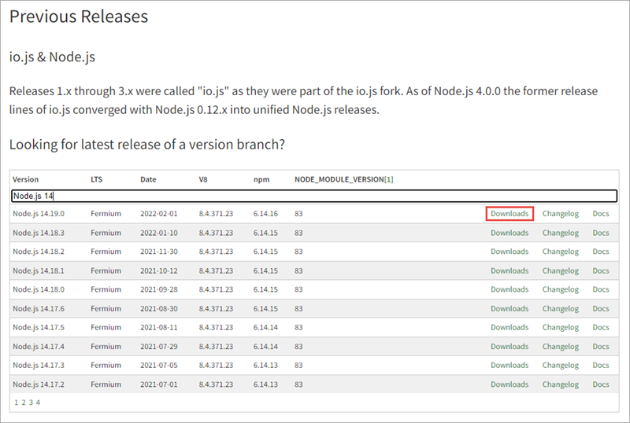
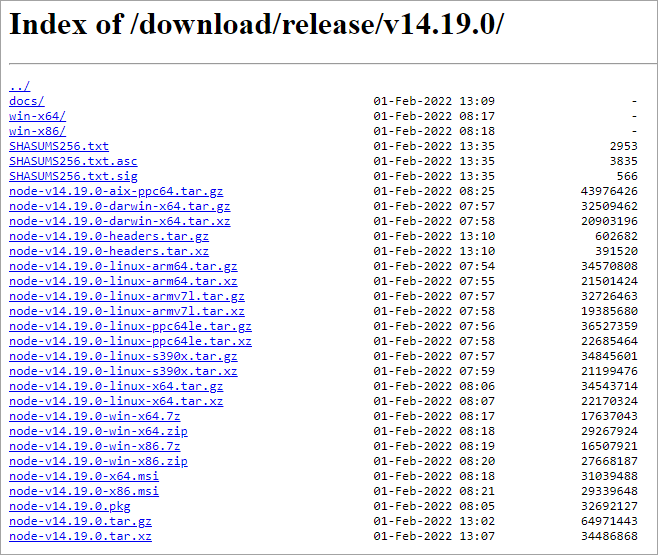

# Exercise 2: Configure your SharePoint Framework development environment

In this exercise, you'll set up your local developer environment with everything you need to start creating SharePoint Framework components.

## Task 1: Install a code editor

You'll need a text editor to edit your code files. There are no requirements for what you need in a text editor.

The rest of this lab, and most of the examples you'll find from Microsoft, use [Visual Studio Code](https://code.visualstudio.com/).

## Task 2: Install Node.js

The tools used in compiling, debugging, and packaging SharePoint Framework projects are built using Node.js, which is a runtime that enables JavaScript to run locally versus in a browser. So, the first step is to install the runtime, Node.js, before installing the required tools.

> Node.js is available in two different releases: the long term support release (aka: LTS) is the most stable version that is recommended for most users while the current version contains the latest features.
> Before installing Node.js, you should verify that you haven't installed it previously. Open a command prompt or terminal (depending on your developer platform) and execute the following command:
>
> ```console
> node -v
> ```
>
> If a version number is returned, you already have Node.js. The version(s) of Node.js you may use depends on the environment(s) you'll be targeting.
>
> If you are building projects for SharePoint 2016, then you need to use the SharePoint Framework v1.1.0 due to the server-side version dependencies. This means you should install Node.js v6.x. For more information on SharePoint Framework development with SharePoint 2016, please refer to [SharePoint Framework development with SharePoint Server 2016 Feature Pack 2](/sharepoint/dev/spfx/sharepoint-2016-support). Please also refer to [SharePoint Framework development for SharePoint Server 2016 with Feature Pack 2](https://www.voitanos.io/blog/how-to-setup-sharepoint-framework-development-environment-for-multiple-sharepoint-server-deployments/#sharepoint-framework-development-for-sharepoint-server-2016-with-feature-pack-2) for information about how to address a versioning issue with one of Yeoman's dependencies.
>
> If you are building projects for SharePoint 2019, then you need to use the SharePoint Framework v1.4.1 because of the server-side version dependencies. This means you should install Node.js v6.x or v8.x. For more information on SharePoint Framework development with SharePoint 2019, please refer to [SharePoint Framework development with SharePoint Server 2019](/sharepoint/dev/spfx/sharepoint-2019-support).
>
> If you are building projects for SharePoint Online, then it is recommended that you install the latest version of Node.js v14.x and the latest version of the SharePoint Framework, which is currently v1.14.0.

### SharePoint Framework / Node.js / SharePoint Version Compatibility

| SPFx    | Node.js                         | SP 2016 | SP 2019 | SP Online |
| ------- | ------------------------------- | ------- | ------- | --------- |
| v1.14.0 | v12.13.0+, v14.15.0+            |         |         |     X     |
| v1.13.1 | v12.13.0+, v14.15.0+            |         |         |     X     |
| v1.13.0 | v12.13.0+, v14.15.0+            |         |         |     X     |
| v1.12.1 | v10.13.0+, v12.13.0+, v14.15.0+ |         |    X    |     X     |
| v1.11.0 | v10.x                           |         |    X    |     X     |
| v1.10.0 | v8.x, v10.x                     |    X    |    X    |     X     |
| v1.9.1  | v8.x, v10.x                     |    X    |    X    |     X     |
| v1.9.0  | v8.x, v10.x                     |    X    |    X    |     X     |
| v1.8.2  | v8.x, v10.x                     |    X    |    X    |     X     |
| v1.8.1  | v8.x                            |    X    |    X    |     X     |
| v1.8.0  | v8.x                            |    X    |    X    |     X     |
| v1.7.1  | v8.x                            |    X    |    X    |     X     |
| v1.7.0  | v8.x                            |    X    |    X    |     X     |
| v1.6.0  | v6.x, v8.x                      |    X    |    X    |     X     |
| v1.5.1  | v6.x, v8.x                      |    X    |    X    |     X     |
| v1.5.0  | v6.x, v8.x                      |    X    |    X    |     X     |
| v1.4.1  | v6.x, v8.x                      |    X    |    X    |     X     |
| v1.4.0  | v6.x, v8.x                      |    X    |         |     X     |
| v1.2.0  | v6.x, v8.x                      |    X    |         |     X     |
| v1.1.1  | v6.x, v8.x                      |    X    |         |     X     |
| v1.1.0  | v6.x                            |    X    |         |     X     |
| v1.0.0  | v6.x                            |         |         |     X     |

> For SharePoint Framework v1.1.1 through 1.4.0, a workaround is required when debugging in the local or hosted workbench if you have Node.js v8.x installed. Please see the following GitHub issue for more information: [Run gulp serve with 'NODE_NO_HTTP2=1' when using SPFx on node v8](https://github.com/SharePoint/sp-dev-docs/issues/1002).

> For more information on SharePoint Framework version compatibility, including compatibility with NPM, TypeScript, and React, please refer to [SharePoint Framework development tools and libraries compatibility](/sharepoint/dev/spfx/compatibility).

If you already have a version of Node.js that's compatible with the environment(s) you'll be targeting, then skip to the next section.

Open a browser and navigate to the Node.js Foundation site: https://www.nodejs.org.

The LTS version is currently 16.x so you'll need to navigate further into the site to find the appropriate installer.

Select **Downloads** from the top menu navigation then scroll to the bottom of the page and select **Previous Releases**.


In the Previous Releases page, select the version of Node.js you wish to install.



Download the appropriate installer or binary for the platform you're using.



Run the installer, accepting all the default options. This will install Node.js and NPM (*a package manager that Node.js uses, similar to .NET's NuGet*).

> [!IMPORTANT]
> The remainder of the material in this module assumes that you are building projects for SharePoint Online.


## Task 3: Install required tools

The SharePoint Framework development experience uses a set of tools built on Node.js that are popular among web developers. These tools are built on Node.js, which means they can be used on any platform and will work the same way. This includes Windows, macOS, and Linux.

### Install Yeoman

Yeoman is a scaffolding engine, which executes *generators* that prompt the user with questions. Based on the answers to these questions, Yeoman then creates the folders and files defined by the generator.

Open a command prompt / terminal window and execute the following command to install Yeoman globally with NPM:

```console
npm install --global yo
```

### Install Gulp CLI

Gulp is a task runner utility. It's similar to MSBuild, a tool used by .NET developers and Visual Studio to compile projects, package solutions, and start a debugging experience.

Gulp comes in two parts: the Gulp CLI (command line utility) that is installed globally on your computer, and then local Gulp packages included in each individual project.

Prior to the release of SharePoint Framework v1.13.1, Microsoft's guidance was to install Gulp globally. Around the time of the release of SharePoint Framework v1.13.1, that guidance changed to installing Gulp CLI globally. Doing so enables you to have some projects that use Gulp v3 and other projects that use Gulp v4.

> [!IMPORTANT]
> If you previously installed Gulp globally, you need to uninstall it before installing Gulp CLI.
To uninstall Gulp, open a command prompt / terminal window and execute the following command:

```console
npm uninstall --global gulp-cli
```

To install Gulp CLI, open a command prompt / terminal window and execute the following command:

```console
npm install --global gulp-cli
```

### Install the SharePoint Framework Yeoman generator

Microsoft has created a Yeoman generator for scaffolding SharePoint Framework projects.

To install the latest version of the SharePoint Framework Yeoman generator globally with NPM, open a command prompt / terminal window and execute the following command:

```console
npm install --global @microsoft/generator-sharepoint
```

To install a specific version of the SharePoint Framework Yeoman generator globally with NPM, open a command prompt / terminal window and execute the following command:

```console
npm install --global @microsoft/generator-sharepoint@[version number]
```

For example:

```console
npm install --global @microsoft/generator-sharepoint@1.9.1
```

## Summary

In this exercise, you set up your local developer environment with everything you need to start creating SharePoint Framework components.
