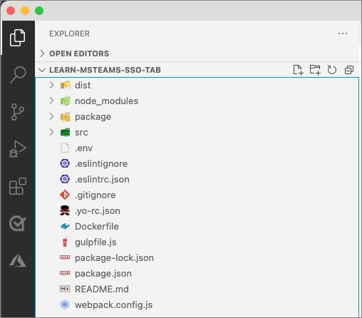
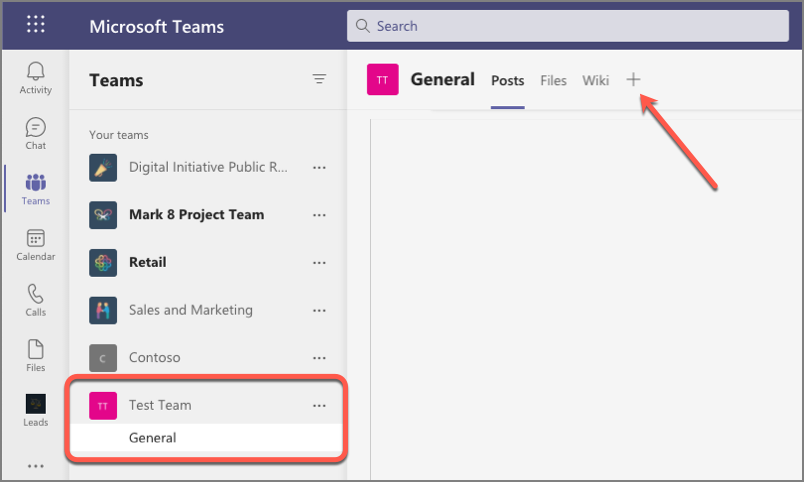
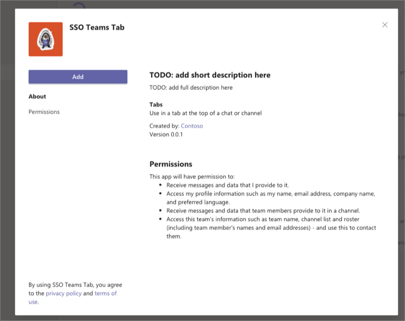
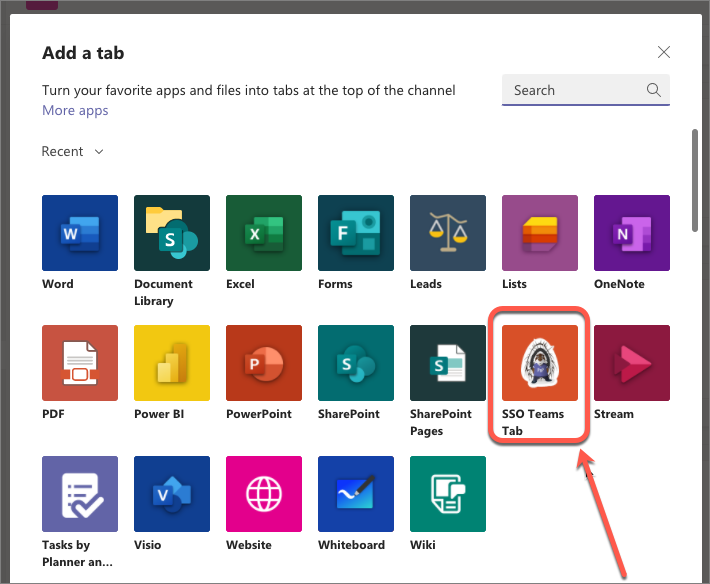
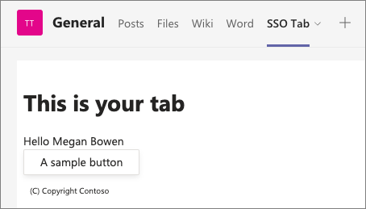
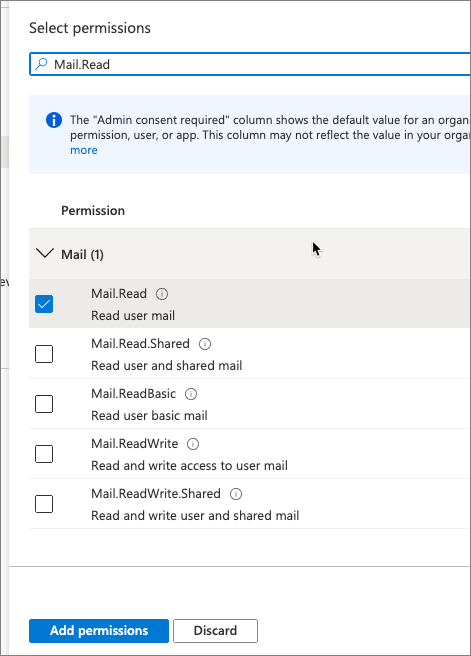
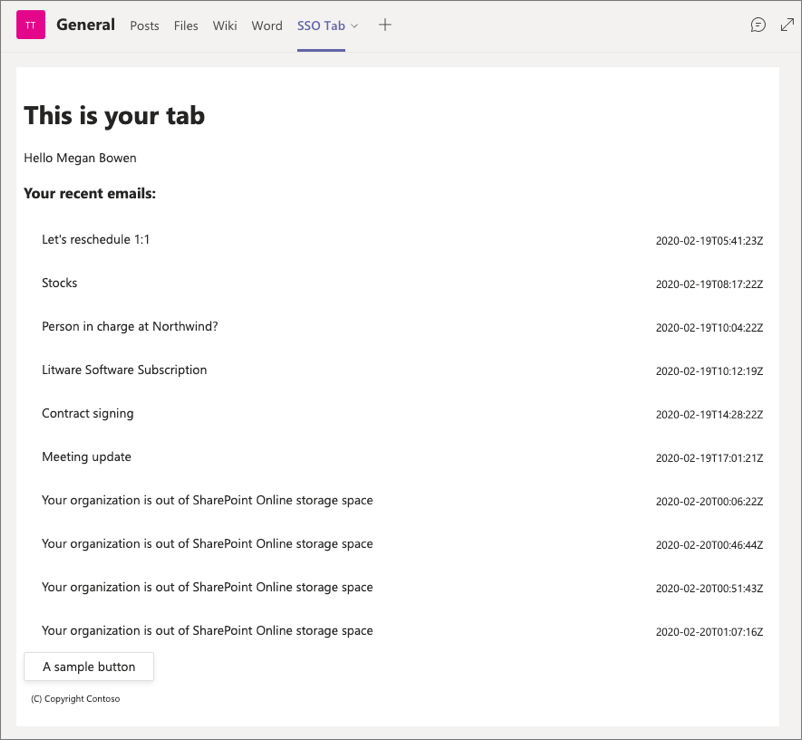

# Exercise 2: Implement single sign-on with Microsoft Teams tabs


In this exercise, you'll add a custom tab to a Microsoft Teams app and use single sign-on (SSO) to obtain an access token to submit requests to Microsoft Graph.

> [!IMPORTANT]
> This exercise assumes you have created the Azure AD app from the previous exercise in this module.

## Prerequisites

Developing Microsoft Teams apps requires a Microsoft 365 tenant, Microsoft Teams configured for development, and the necessary tools installed on your workstation.

For the Microsoft 365 tenant, follow the instructions on [Microsoft Teams: Prepare your Microsoft 365 tenant](/microsoftteams/platform/get-started/get-started-tenant) for obtaining a developer tenant if you don't currently have a Microsoft 365 account. Make sure you have also enabled Microsoft Teams for your organization.

Microsoft Teams must be configured to enable custom apps and allow custom apps to be uploaded to your tenant to build custom apps for Microsoft Teams. Follow the instructions on the same **Prepare your Microsoft 365 tenant** page mentioned above.

You'll use Node.js to create a custom Microsoft Teams app in this module. The exercises in this module assume you have the following tools installed on your developer workstation.

> [!IMPORTANT]
> In most cases, installing the latest version of the following tools is the best option. The versions listed here were used when this module was published and last tested.

- [Node.js](https://nodejs.org/) - v12.\* (or higher)
- NPM (installed with Node.js) - v6.\* (or higher)
- [Gulp-cli](https://gulpjs.com/) - v2.\* (or higher)
- [Yeoman](https://yeoman.io/) - v3.\* (or higher)
- [Yeoman Generator for Microsoft Teams](https://github.com/pnp/generator-teams) - v3.5.0 (or higher)
- [Visual Studio Code](https://code.visualstudio.com)

You must have the minimum versions of these prerequisites installed on your workstation.

## Task 1: Create your Microsoft Teams app project

Open your command prompt, navigate to a directory where you want to save your work, create a new folder **learn-msteams-sso-tab**, and change directory into that folder.

Run the Yeoman Generator for Microsoft Teams by running the following command:

```console
yo teams
```

Yeoman will launch and ask you a series of questions. Answer the questions with the following values:

- **What is your solution name?**: learn-msteams-sso-tab
- **Where do you want to place the files?**: Use the current folder
- **Title of your Microsoft Teams App project?**: SSO Teams Tab
- **Your (company) name? (max 32 characters)**: Contoso
- **Which manifest version would you like to use?**: v1.11
- **Quick scaffolding**: Yes
- **What features do you want to add to your project?**: A Tab
- **The URL where you will host this solution?**: `https://REPLACE.ngrok.io`
- **Would you like to show a loading indicator when your app/tab loads?** No
- **Default Tab name? (max 16 characters)**: SSO Tab
- **What kind of Tab would you like to create?**: Configurable
- **What scopes do you intend to use for your Tab?**: In a Team
- **Do you require Azure AD Single-Sign-On support for the tab?** Yes
- **What is the Application ID to associate with the SSO Tab?**: *Enter the **Application (Client) ID** for the Azure AD application you registered in the previous exercise*
- **What is the Application ID URI to associate with the SSO Tab?**: (Accept the default)
- **Do you want this tab to be available in SharePoint Online?**: No

> [!NOTE]
> Most of the answers to these questions can be changed after creating the project. For example, the URL where the project will be hosted and Application ID URI must be changed when you start debugging your project using the ngrok utility.

After answering the generator's questions, the generator will create the scaffolding for the project and then execute `npm install` that downloads all the dependencies required by the project.

## Task 2: Explore the initial project

Let's explore a few parts of the project created by the Yeoman Generator for Microsoft Teams in Visual Studio Code.



### Client-side web app

The **./src/client** and **./src/public** folders represent the web app that implements the custom Microsoft Teams tab app.

Open the **./.env** file that contains the environment variables used by the project. Take note of the following properties that were set from the project creation process:

- **PUBLIC_HOSTNAME**: This is the fully qualified URL, excluding the protocol, you specified where the app would be hosted.
- **APPLICATION_ID**: This is the unique ID of the Microsoft Teams application.
- **TAB_APP_ID**: This is the Azure AD application (client) ID that you specified.
- **TAB_APP_URI** This is the Azure AD application ID URI you specified.

> [!IMPORTANT]
> Each time ngrok starts, it generates a new dynamic subdomain for the URL. If you have to restart ngrok, you will need to repackage and and update the app in Microsoft Teams to make the installed app aware of the new URL. The optional licensed version of ngrok allows you to define and reuse the same subdomain.

The web application in the project consists of static and dynamic assets. All the static assets such as images, HTML, and CSS files are found in the **./src/public** folder while the dynamic assets such as TypeScript and React controls are found in the **./src/client** folder.

For this project, notice the tab is implemented as a React functional component in the **./src/client/ssoTab** folder. Each of the components within that folder are hosted in corresponding HTML files in the **./src/public/ssoTab** folder.

The React component that makes up the content of the is the **./src/client/ssoTab/SsoTab.tsx** file. Locate and open this file.

This file exports a single functional component that returns the React component's UX. This can be found near the bottom of the file in the `return` statement.

The default tab is implemented using [React hooks](https://reactjs.org/docs/hooks-intro.html). The `useEffect()` hook performs side effects when a component mounts or when React changes the DOM. The default tab contains two of these hooks.

The job of the first hook runs after the component has rendered and first checks to see if it is running within Microsoft Teams. If it is, it calls the `getAuthToken()` method on the Microsoft Teams JavaScript SDK to obtain an ID token from Microsoft Teams.

When this method is called, it triggers Microsoft Teams to obtain an ID token from Azure AD's token endpoint for the currently signed in user. Once received, the success callback decodes the token to extract the current user's name. It then sets the React component's state property `name` to the name in the ID token using the `setName()` method.

```typescript
useEffect(() => {
  if (inTeams === true) {
    microsoftTeams.authentication.getAuthToken({
      successCallback: (token: string) => {
        const decoded: { [key: string]: any; } = jwtDecode(token) as { [key: string]: any; };
        setName(decoded!.name);
        microsoftTeams.appInitialization.notifySuccess();
      },
      failureCallback: (message: string) => {
        setError(message);
        microsoftTeams.appInitialization.notifyFailure({
          reason: microsoftTeams.appInitialization.FailedReason.AuthFailed,
          message
        });
      },
      resources: [process.env.TAB_APP_URI as string]
    });
  } else {
    setEntityId("Not in Microsoft Teams");
  }
}, [inTeams]);
```

Notice the `getAuthToken()` method accepts an object with three properties. in addition to the two callbacks, you also set the Application ID URL of the Azure AD application you registered and associated with this Microsoft Teams app. Azure AD will automatically trust the Microsoft Teams client to act on the current user's behalf because in a previous exercise you granted it the `access_as_user` scope.

### Server-side web app

The other part of the project is a server-side web app that hosts and serves up the web assets. This is found in the **./src/server/server.ts** file.

You'll need to make a change to this later, but for now you can review the comments in the **server.ts** file to review what it does.

## Task 3: Build and test the application

Before customizing the tab, let's test the tab to see the initial developer experience for testing.

From the command line, navigate to the root folder for the project and execute the following command:

```console
gulp ngrok-serve
```

This gulp task will run many other tasks all displayed within the command-line console. The **ngrok-serve** task builds your project and starts a local web server (http://localhost:3007). It then starts ngrok with a random subdomain that creates a secure URL to your local webserver.

> [!NOTE]
> Microsoft Teams requires all content displayed within a tab be loaded from an HTTPS request. In development, can be done using the tool [ngrok](https://www.ngrok.com) that creates a secure rotatable URL to your local HTTP webserver. Ngrok is included as a dependency within the project so there is nothing to setup or configure.

> [!IMPORTANT]
> Each time ngrok starts, it generates a new dynamic subdomain for the URL. If you have to restart ngrok, you will need to repackage and and update the app in Microsoft Teams to make the installed app aware of the new URL. The optional licensed version of ngrok allows you to define and reuse the same subdomain.


Before testing the Microsoft Teams app, you need to update all locations where you entered the URL `REPLACE.ngrok.io` in both your project and the Azure AD app you registered. For example:

- **Visual Studio Code project**
  - Locate and open the **./.env** file
  - Find & replace all instances of `REPLACE.ngrok.io`
- **Azure AD Application > Authentication > Redirect URIs**
- **Azure AD Application > Expose an API > Application ID URI**

In the browser, navigate to **https://teams.microsoft.com** and sign in with the credentials of a Work and School account.

Select a team that you want to install and test your custom teams app in and then select the team's **General** channel.

Next, select the plus icon to the right of the existing tabs to add a new tab:



The app containing our new tab isn't installed yet, so in the **Add a tab** dialog, select **Manage apps** in the lower-right corner.

On the next screen, select the **Upload a custom app** link in the lower right corner of the screen below the list of existing installed apps.

Locate and select the Microsoft Teams app package, found in the **./package** folder in your Visual Studio Code project to upload the app.

> [!NOTE]
> If the **./package** folder is not present, this means you are affected by a bug in the yoteams-deploy package. To resolve the issue:
> - Stop the local web server by pressing <kbd>CTRL</kbd>+<kbd>C</kbd> in the console.
> - Install the preview version of the **yoteams-deploy** package using the command `npm install yoteams-deploy@preview`
> - Restart the server process: `gulp ngrok-serve`

Microsoft Teams will display the details of the app in a dialog. Select the **Add** button to install the app into the current team:



After installing the app, select the team's **General** channel, and then the plus icon to the right of the existing tabs in the channel. When prompted to select the tab, select the **SSO Teams Tab**:



When you select the tab to add to the channel, Microsoft Teams will present the tab's configuration screen. Enter anything into the provided input box and select **Save** to add the tab.

When the tab loads, it will initiate the SSO process with Azure AD and obtain an ID token. This token contains the basic identification information about the current user. The current user's display name is included in this token and is displayed in the tab:



## Task 4: Add support to submit requests to Microsoft Graph


At this point, our tab uses Microsoft Teams' SSO support to obtain an ID token for the current user. This ID token can only be used to identify the user, but it can't be used to authenticate requests with Microsoft Graph.

To submit requests to Microsoft Graph, you must include an access token with the necessary permissions for Microsoft Graph for the current user. You can update the project to submit the ID token to Azure AD's token endpoint to exchange it for an access token that can be used to authenticate requests to Microsoft Graph. This is done by implementing the [OAuth2 On-Behalf-Of (OBO) flow](/azure/active-directory/develop/v2-oauth2-on-behalf-of-flow), but this can't be done client-side, rather it must be done server-side.

### Update project to obtain access tokens for Microsoft Graph via the OAuth2 OBO flow

In your Microsoft Teams app project, locate and open the **./.env** file. At the end of the file, there are two environment variables that were set by the Yeoman generator when you created the project. Their names are based on the name of the project:

```text
TAB_APP_ID=...
TAB_APP_URI=...
```

Add the following two properties after these two existing properties. Set the first to the Azure AD app's client secret you created in the previous exercise, and the second to the permissions defined by the app, separated by spaces:

```text
TAB_APP_SECRET=<CLIENT_SECRET>
TAB_APP_SCOPES=https://graph.microsoft.com/User.Read email openid profile offline_access
```

> [!TIP]
> The list of scopes, also known as permissions, can be found from the registered Azure AD app's **API Permissions** page in the Azure AD admin portal.

The next step is to update the server-side API to add support for using the ID token, obtained by Microsoft Teams, for an OBO access token that can be used to submit requests to Microsoft Graph.

Locate, and open the **./src/server/server.ts** file.

Add the following two `import` statements after the existing `import` statements:

```typescript
import jwtDecode from "jwt-decode";
import Axios, { AxiosResponse } from "axios";
```

Now, add a route that takes the SSO ID token from the request and submits a request to Azure AD using the OAuth OBO flow to exchange it for an OAuth access token that can be used to authenticate requests to Microsoft Graph.

Locate the following lines near the end of the **server.ts** file:

```typescript
// Set the port
express.set("port", port);
```

Add the following code before the lines you just found that set the listening port on the solution. The comments within the code explain the relevant parts:

```typescript
express.get("/exchangeSsoTokenForOboToken", async (req, res) => {
  log("getting access token for Microsoft Graph...");

  const clientId = process.env.TAB_APP_ID as string;
  const clientSecret = process.env.TAB_APP_SECRET as string;
  const ssoToken = req.query.ssoToken as string;

  // build Azure AD OAuth2 token endpoint
  const aadTokenEndpoint = `https://login.microsoftonline.com/${jwtDecode<any>(ssoToken).tid}/oauth2/v2.0/token`;

  // build body of request to obtain an access token using the OAuth2 OBO flow
  const oAuthOBOParams = {
    grant_type: "urn:ietf:params:oauth:grant-type:jwt-bearer",
    client_id: clientId,
    client_secret: clientSecret,
    assertion: ssoToken,
    requested_token_use: "on_behalf_of",
    scope: process.env.TAB_APP_SCOPES
  };

  // convert params to URL encoded form body payload
  const oAuthOboRequest = Object.keys(oAuthOBOParams)
    .map((key, index) => `${key}=${encodeURIComponent(oAuthOBOParams[key])}`)
    .join("&");

  const HEADERS = {
    accept: "application/json",
    "content-type": "application/x-www-form-urlencoded"
  };

  try {
    // submit request
    const response = await Axios.post(aadTokenEndpoint, oAuthOboRequest, { headers: HEADERS });

    // check response
    if (response.status === 200) {
      // on successful response, return full object to client
      res.status(200).send(response.data);
    } else {
      // else on non-success...
      if ((response.data.error === "invalid_grant") || (response.data.error === "interaction_required")) {
        // if consent required... reply with 403: Forbidden
        res.status(403).json({ error: "consent_required" });
      } else {
        // else, some other error occurred... fail
        res.status(500).json({ error: "Could not exchange access token" });
      }
    }
  } catch (error) {
    // for all others, fail
    res.status(400).json({ error: `Unknown error: ${error}` });
  }
});
```

### Update the SSO tab to exchange the ID token for an access token

With the server-side API updated, we can now update the SSO tab to exchange the ID token obtained by Microsoft Teams and it's SSO support for an access token that can be used to authenticate requests for Microsoft Graph.

Locate and open the file **./src/client/ssoTab/SsoTab.tsx**.

Next, locate the `import` statement for the `react` package and add the `useCallback` hook to the list of imports:

```typescript
import { useState, useEffect, useCallback } from "react";
```

This file contains a single functional component exported to the caller. Near the top of this component's declaration, locate a collection of `const` declarations that configure the initial state of the React component.

Add the following to add a few more properties to the component's state. These will be used to store the ID token and access token

```typescript
const [ssoToken, setSsoToken] = useState<string>();
const [msGraphOboToken, setMsGraphOboToken] = useState<string>();
```

Now locate the `useEffect()` hook (*the first one in the file*) that the tab is using to obtain the ID token from Microsoft Teams. When the request to authenticate with the Microsoft Teams SDK is successful, it parses the returned ID token to obtain the signed in user's name and sets it to the component's state property `name`. This triggers React to re-render the component and display the user's name.

Let's update this to save the ID token to the component's `ssoToken` state property. Locate the following line in the success callback:

```typescript
microsoftTeams.appInitialization.notifySuccess();
```

Add the following line immediately before the `notifySuccess()` call:

```typescript
setSsoToken(token);
```

In order to submit requests to Microsoft Graph, it needs to exchange this SSO obtained ID token for an access token. This is an asynchronous request to the server-side API endpoint you previously implemented. Add the following `useCallback()` hook to implement token exchange request:

```typescript
const exchangeSsoTokenForOboToken = useCallback(async () => {
  const response = await fetch(`/exchangeSsoTokenForOboToken/?ssoToken=${ssoToken}`);
  const responsePayload = await response.json();
  if (response.ok) {
    setMsGraphOboToken(responsePayload.access_token);
  } else {
    if (responsePayload!.error === "consent_required") {
      setError("consent_required");
    } else {
      setError("unknown SSO error");
    }
  }
}, [ssoToken]);
```

To initiate this process, add another `useEffect()` hook that's triggered when the `ssoToken` state property is updated by the call to `setSsoToken()` we previously added:

```typescript
useEffect(() => {
  // if the SSO token is defined...
  if (ssoToken && ssoToken.length > 0) {
    exchangeSsoTokenForOboToken();
  }
}, [exchangeSsoTokenForOboToken, ssoToken]);
```

At this point, the tab has an access token that will authenticate requests to Microsoft Graph, so the next step is to submit a request to Microsoft Graph.

### Display a list of recent emails


In this step, you'll update the Azure AD app and Microsoft Teams app project to display a list of the recent emails received by the currently logged in user with Microsoft Graph.

#### Update the Azure AD app's permissions

The registered Azure AD app must be granted permissions to the app.

Open a browser and navigate to the [Azure Active Directory admin center (https://aad.portal.azure.com](https://aad.portal.azure.com)). Sign in using a **Work or School Account** that has global administrator rights to the tenancy.

In the left-hand navigation, select **Manage > API permissions**.

Add a new permission by selecting **Add a permission**.

On the **Select an API** screen, select **Microsoft Graph**, then select **Delegated permissions**. Search for and select permission **Mail.Read** and select **Add permissions**.



Next, select the **Grant admin consent for Contoso** followed by accepting the confirmation prompt by selecting **Yes**.

#### Update the project's server-side permission request

The new **Mail.Read** permission you added to the Azure AD app needs to be included in the list of permissions the server-side API requests when it exchanges the ID token for an access token. This is to ensure the current user has consented to the permissions the app needs.

Locate and open the **./.env** file in your project.

Near the end of the file, locate the existing environment variable `TAB_APP_SCOPES`. Update this property to include the request for the **Mail.Read** property:

```text
TAB_APP_SCOPES=https://graph.microsoft.com/User.Read https://graph.microsoft.com/Mail.Read email openid profile offline_access
```

#### Update the Microsoft Teams tab

The next step is to update the tab project to call Microsoft Graph to obtain a list of the user's recent email.

In Visual Studio Code, locate and open the **./src/client/ssoTab/SsoTab.tsx** file.

First, add a new React component to display a list of items. Locate the following line at the top of the file:

```typescript
import { Provider, Flex, Text, Button, Header } from "@fluentui/react-northstar";
```

Add the `List` component to the `import` statement:

```typescript
import { Provider, Flex, Text, Button, Header, List } from "@fluentui/react-northstar";
```

Next, add the following line after the existing `const` statements at the top of the component. This will add a new state property to the React component to store the list of emails:

```typescript
const [recentMail, setRecentMail] = useState<any[]>();
```

With the state of the component updated, now add the following `useCallback()` hook to request the last 10 emails using Microsoft Graph:

```typescript
const getRecentEmails = useCallback(async () => {
  if (!msGraphOboToken) { return; }

  const endpoint = "https://graph.microsoft.com/v1.0/me/messages?$select=receivedDateTime,subject&$orderby=receivedDateTime&$top=10";
  const requestObject = {
    method: "GET",
    headers: {
      Authorization: "Bearer " + msGraphOboToken
    }
  };

  const response = await fetch(endpoint, requestObject);
  const responsePayload = await response.json();

  if (response.ok) {
    const recentMail = responsePayload.value.map((mail: any) => ({
      key: mail.id,
      header: mail.subject,
      headerMedia: mail.receivedDateTime
    }));
    setRecentMail(recentMail);
  }
}, [msGraphOboToken]);
```

We want to get the list recent emails once we have an access token that can be used to authenticate with Microsoft Graph. Because we've already added that code, we just need to add a new `useEffect()` hook that runs when the `msGraphOboToken` state property is updated.

Add the following code immediately before the existing `return` statement.

```typescript
useEffect(() => {
  getRecentEmails();
}, [getRecentEmails, msGraphOboToken]);
```

The last step is to update the rendering in the component's `return` statement to include the list of recent emails. Locate following code in the `return` statement:

```tsx
<div>
  <Text content={`Hello ${name}`} />
</div>
```

Add the following code immediately after the above code:

```tsx
{recentMail && <div><h3>Your recent emails:</h3><List items={recentMail} /></div>}
```

## Task 5: Build and retest the application

Go back to the browser and navigate back to the tab you added earlier in this exercise. Notice how it's now displaying all your recent emails:

> [!IMPORTANT]
> If the **ngrok-serve** stopped for any reason, remember when you start/restart the **gulp ngrok-serve** task, the dynamic ngrok URL will change.
>
> You'll need to update all the locations where you set the URL in your project as well as in the Azure AD app registration as previously explained.
>
> In addition, you'll need to reinstall your app package because the Microsoft Teams app manifest contains the URL. To do this, you'll first need to increment the `version` property in the app's **./manifest/manifest.json** file. This value is dynamically set using the `version` property from the **./package.json** file. When you repeat the installation process of the app, it will update the existing installation.



